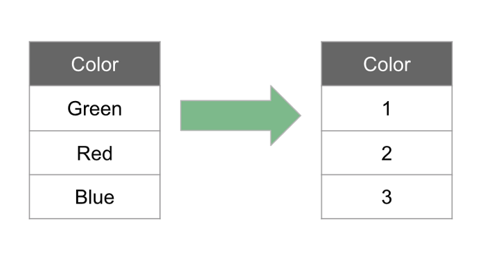

# Different Encoding Techniques for Categorical Data

- Most of the Machine Learning Algorithms cannot handle categorical data until they are converted into numerical data.
- Many algorithm’s performances vary based on how Categorical variables are encoded.
- The categorical data's are basically divided into 2 categories.
  1. **Binary** : The variable has only two values, True/False.
  2. **Ordinal** : Data which are in or has some order.
  3. **Nominal** : Data which doesn't have any particular order or has no numerical importance.

<center>

</center>

- ### Examples for the **Nominal** variable:
  - **Colors** : Red, Yellow, Pink, Blue
  - **Country** : Singapore, Japan, USA, India, Korea
  - **Animal** : Cow, Dog, Cat, Snake
  
- ### Example of **Ordinal** variables:
  - High, Medium, Low
  - Strongly agree, Agree, Neutral, Disagree, and Strongly Disagree.
  - Excellent, Okay, Bad

## 1. Binary Feature Encoding
- Binary features are those who has only two possible values, True and False.
- The binary features can also be encoded using the Panda's `replace()`.
- For Example :

```python
df['gender'] = df['gender'].replace({'F' : 0, 'M' : 1})
df['posted'] = df['posted'].replace({'Y' : 0, 'N' : 1})
```
- Here, we pass a dictionary to the `replace()` with the current value as the key and as the desired value as the value.
- Using `replace()` is very useful for binary feature but would be tactic task if we have multiple category data.
- So, for such data we use **Ordinal Feature Encoding**.

## 2. Ordinal Feature Encoding
- Ordinal features are those with some order associated with them. 
- The machine learning model may be able to use the order information to make better predictions.
- For ordinal features, we use integer encoding. 
- To integer encode our data we simply convert labels to integer values.

<center>


#### Label Encoding
</center>

- There are many methods for integer encoding, like `LabelEncoder()` from sklearn library. 
- Apart from these methods from sklearn, we have Panda's `map()` that substitutes each value with another specified value, similar to `replace()`.
- These methods should only be used for ordinal features, where the order matters. 
- For features where order is not important we must explore other techniques.

## Nominal Feature Encoding
- Nominal features are categorical features that have no numerical importance. Order does not matter.
- One-hot encoding is a better technique when order doesn’t matter.
- In a situation, where order doesn’t matter, integer encoding could lead to poor model performance and should not be used.

<center>


#### One Hot Encoding
</center>

- In one hot encoding, a new binary (dummy) variable is created for each unique value in the categorical variable. 
- In the chart above, we have three unique colors, and so we create three new features, one for each color. 
- If the value is true, the integer 1 is placed in the field, if false then a 0.
- Here, we can use Panda’s `get_dummies()` to one hot encode our nominal features.
- This method converts a categorical variable to dummy variables and returns a dataframe. 

```python
nominal_features = pd.get_dummies(nominal_features, drop_first=True)
```
- The drop_first parameter is helpful to get k-1 dummies by removing the first level.

<center>


#### Nominal Feature after Encoding
</center>

- In the situation of high cardinality features, those with many possible values, we may need to do some manipulation prior to encoding. 
- For example, for values occurring only a small percent of the time, we could group them into an “other” category.